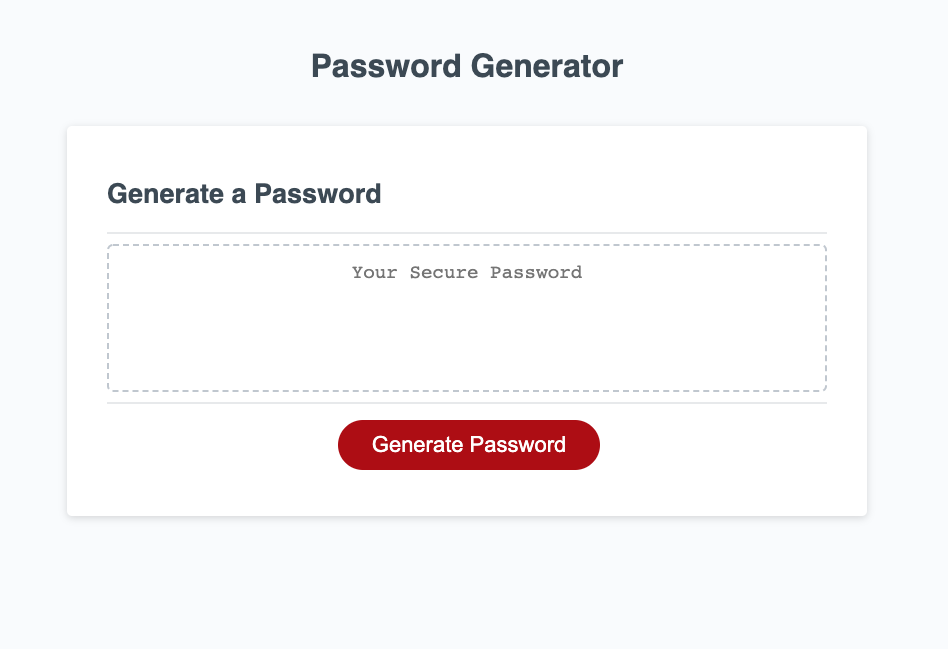

# Password Generator Starter Code
This application randomly generates a password that meets certain/specific criteria, so you can create a strong password that provides greater secuity.

When you click the button to generate a password, you are presented with a series of prompts for password criteria.

When prompted for password criteria, you should select which criteria to include in the password.

You should choose a length of at least 8 characters and no more than 128 characters and must include at least one number. Otherwise, you are given an error message of invalid password length or a number was not included.

When you select the right length, you will also be asked for character types to include in the password. Then you must confirm whether or not to include lowercase, uppercase, numeric, and /or special characters.

After you answer all prompts, a password is generated that matches the selected criteria.
And the password will be displayed on the page.

This application adapts to multiple screen sizes.

web link: https://xiaojing168jmg168.github.io/password-assignment/

